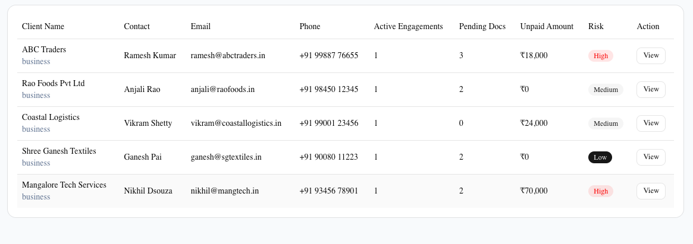
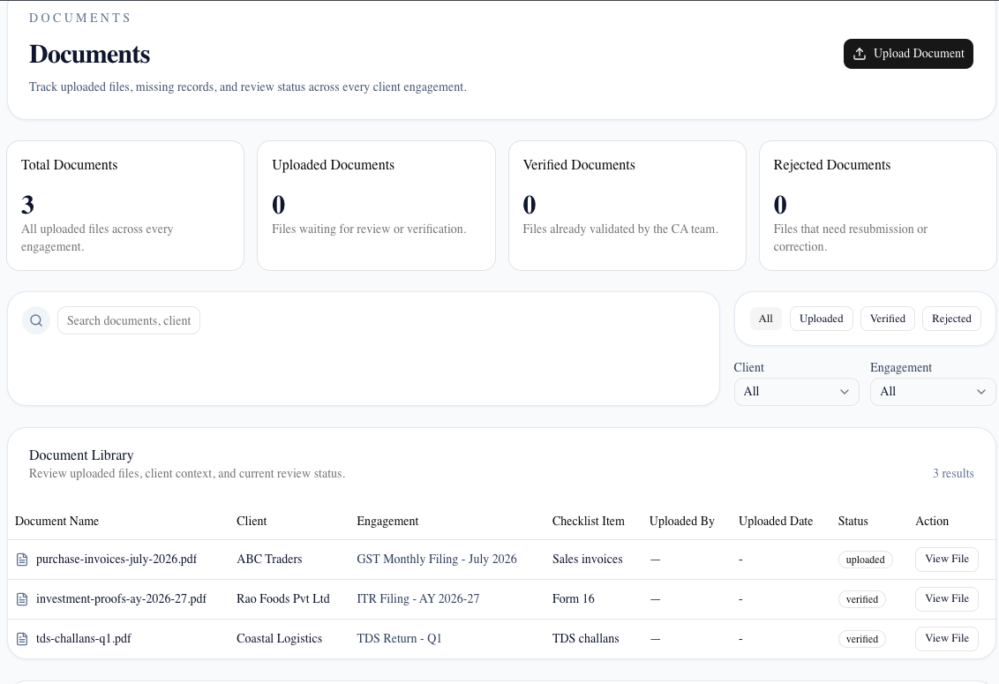
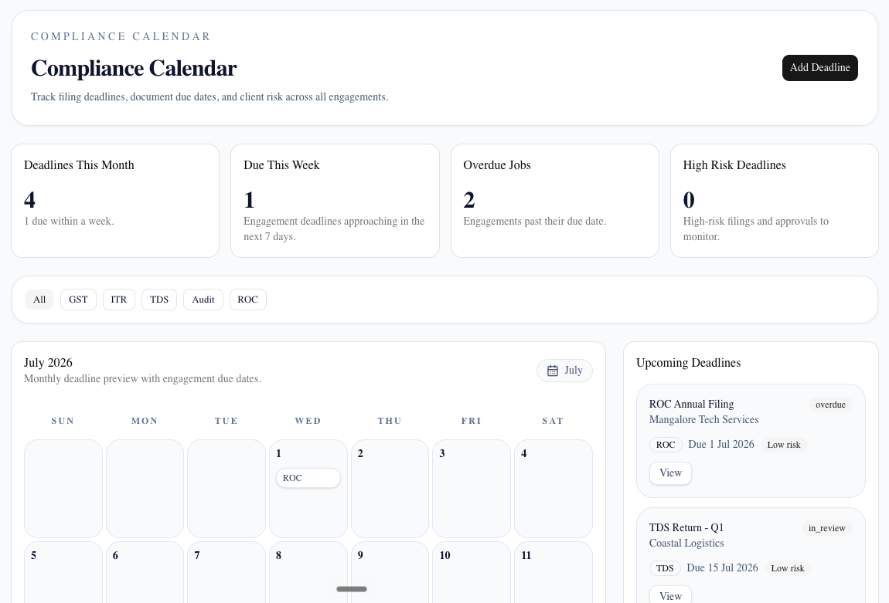
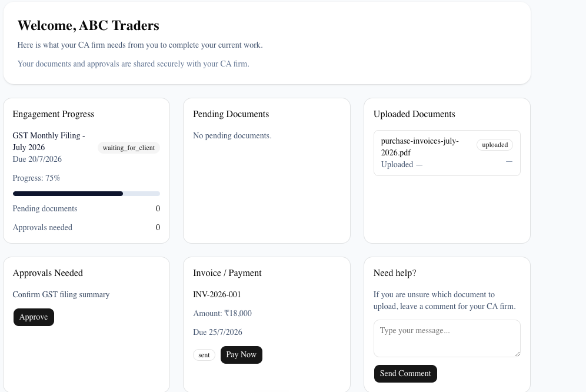

# CA Compliance Vault

A modern web application built to help Chartered Accountants and accounting firms manage clients, engagements, compliance documents, invoices, and approvals from one place.

The goal of this project was to create a clean and organized platform that simplifies day-to-day compliance work while providing clients with a dedicated portal to view documents, invoices, and engagement updates.

---

## Project Preview

> **Dashboard**

<!-- Add dashboard screenshot here -->


---

> **Clients**

<!-- Add clients screenshot here -->


---

> **Client Details**

<!-- Add client details screenshot here -->



---

> **Documents**

<!-- Add documents screenshot here -->



---

> **Invoices**

<!-- Add invoices screenshot here -->


---

> **Calendar**

<!-- Add calendar screenshot here -->



---

> **Settings**

<!-- Add settings screenshot here -->


---

> **Client Portal**

<!-- Add client portal screenshot here -->



---

## Features

### Dashboard

- Overview of firm activity
- Upcoming compliance deadlines
- Recent client activity
- Pending approvals
- Revenue summary

### Client Management

- View all registered clients
- Client profile with complete information
- Engagement history
- Compliance checklist
- Documents and invoices linked to each client

### Engagement Tracking

- Create new engagements
- Assign services
- Track status
- Monitor due dates
- Approval workflow

### Document Management

- Store compliance documents
- Organize documents by client
- Download documents
- Track uploaded files

### Invoice Management

- Invoice overview
- Payment status
- Due dates
- Payment links

### Calendar

- Compliance schedule
- Upcoming deadlines
- Important dates
- Engagement timeline

### Client Portal

Clients can securely access:

- Engagement details
- Uploaded documents
- Invoice history
- Compliance checklist
- Firm communication

### Settings

- Firm profile
- User preferences
- Application configuration

---

## Tech Stack

### Frontend

- Next.js 15
- React
- TypeScript
- Tailwind CSS
- shadcn/ui

### Backend

- Supabase
- PostgreSQL

### Tools

- ESLint
- npm
- Git
- GitHub

---

## Folder Structure

```
app/
components/
lib/
public/

├── dashboard
├── clients
├── engagements
├── documents
├── invoices
├── calendar
├── settings
├── client-portal
```

---

## Database

The project uses Supabase with PostgreSQL.

Main tables include:

- clients
- engagements
- checklist_items
- documents
- invoices

Each module reads data directly from Supabase using the official JavaScript client.

---

## Getting Started

Clone the repository.

```bash
git clone <repository-url>
```

Go into the project.

```bash
cd ca-compliance-vault
```

Install dependencies.

```bash
npm install
```

Create an environment file.

```
.env.local
```

Add your Supabase credentials.

```env
NEXT_PUBLIC_SUPABASE_URL=YOUR_SUPABASE_URL
NEXT_PUBLIC_SUPABASE_PUBLISHABLE_KEY=YOUR_SUPABASE_ANON_KEY
```

Start the development server.

```bash
npm run dev
```

Open

```
http://localhost:3000
```

---

## Future Improvements

Some features planned for future versions include:

- Authentication and role-based access
- Email notifications
- File upload using Supabase Storage
- PDF generation
- Payment gateway integration
- Audit logs
- Analytics dashboard
- Mobile responsive improvements

---

## What I Learned

This project helped me gain hands-on experience with:

- Building applications using Next.js App Router
- Designing reusable React components
- Integrating Supabase with PostgreSQL
- Managing relational data
- Creating responsive user interfaces
- Organizing larger frontend projects
- Debugging API and database issues
- Working with TypeScript in production-style projects

---

## Author

**Adithya Kotian**

---

## License

This project is available for learning and portfolio purposes.