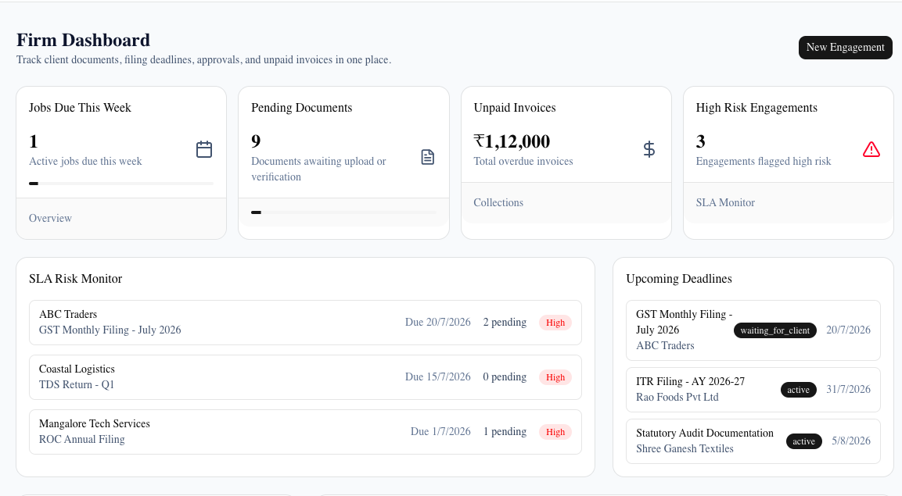
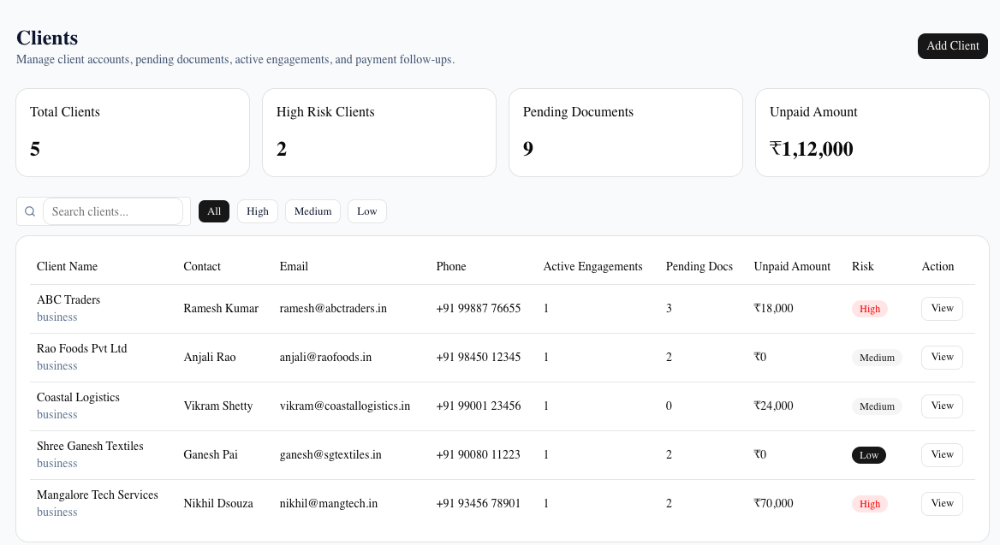
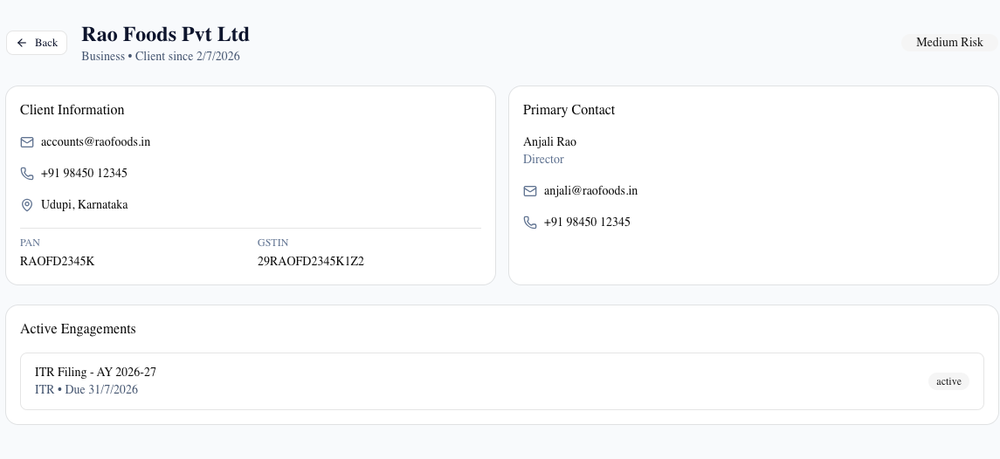
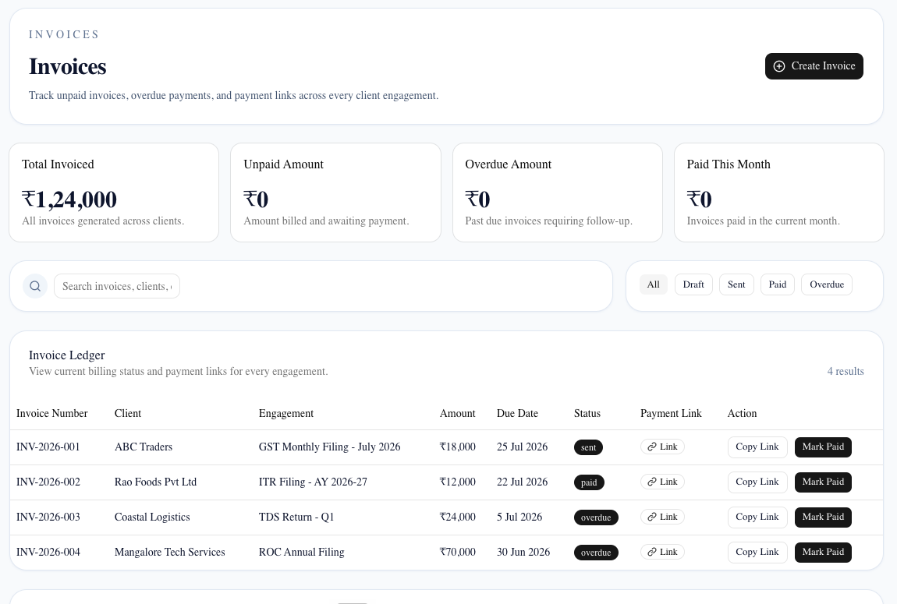
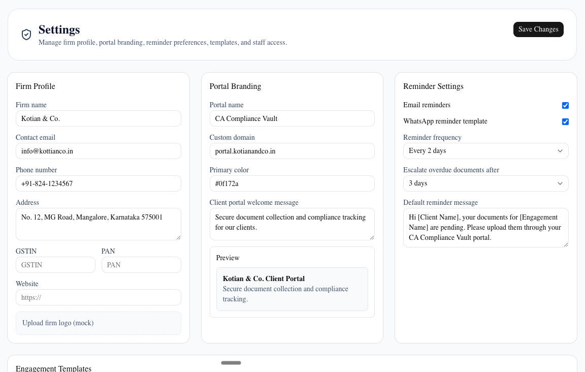

# CA Compliance Vault

A production-grade SaaS platform for Chartered Accountant (CA) and tax consultancy firms to manage clients, compliance engagements, documents, and invoices.

---

## 🔗 Project Links

- **Live Demo**: [https://ca-compliance-vault.vercel.app](https://ca-compliance-vault.vercel.app)
- **GitHub Repository**: [https://github.com/adithyakotian/ca-compliance-vault](https://github.com/adithyakotian/ca-compliance-vault)

---

## 🌟 Features

### Authentication & Security
- Email/password authentication with Supabase Auth
- Role-based access control (Admin, Accountant, Client)
- Password reset and recovery flow with complexity validation
- Protected routes with Next.js Middleware
- PostgreSQL Row Level Security (RLS) policies on all tables

### Client Management
- Full CRUD operations with pre-filled edit forms
- Real-time search and risk-tier filtering (Low, Medium, High)
- Primary contact person mapping (email, phone, designation)
- Cascading deletion with accessible Radix UI confirmation alerts
- Dedicated client detail views (`/clients/[clientId]`)

### Document Management & Vault
- Secure drag-and-drop file upload to Supabase Storage
- Direct download via 60-second expiring signed URLs
- Strict client-side file type (PDF, JPG, PNG, DOCX, XLSX, ZIP) and size validation (max 10MB)
- Live document status tracking (Uploaded, Verified, Pending, Rejected)

### Engagement Management
- Track statutory return filings (ITR, GST, Audit, ROC, TDS, Other)
- Status lifecycle tracking (Not Started, In Progress, Waiting for Client, In Review, Completed, Overdue)
- Priority matrix with deadline sorting, search, and checklist binding
- Cascade deletion of child checklist tasks and uploaded files

### Invoice Management & GST Billing
- Auto-numbering sequence generation (`INV-YYYY-XXXX`)
- Dynamic GST calculation across tax slabs (0%, 5%, 12%, 18%, 28%)
- One-click "Mark as Paid" action with payment timestamps
- Financial dashboards: Total Billed, Collected/Paid, Outstanding Balance, Overdue

### Statutory Calendar & Deadlines
- Interactive monthly grid view with month navigation
- Unified statutory return filing deadlines and invoice due dates
- Color-coded events: Deadline (Red), Meeting (Blue), Task (Green), Reminder (Yellow), Invoice (Purple)
- Dedicated 7-day upcoming deadlines sidebar

### Branded Client Portal
- Isolated client self-service interface (`/client-portal`)
- Session-derived identity verification (prevents IDOR URL tampering)
- Checklist completion progress tracking
- One-click document upload for requested statements
- Invoice viewing with integrated payment links
- Direct communication and messaging thread saved to database

---

## 🛠️ Tech Stack

- **Framework**: Next.js 16 (App Router)
- **UI Library**: React 19, TypeScript
- **Styling**: Tailwind CSS 4, Radix UI Primitives, Lucide React Icons
- **Database & Storage**: Supabase (PostgreSQL, Auth, SSR, Storage Buckets)
- **Forms & Validation**: React Hook Form + Zod
- **Utilities**: date-fns, Sonner (toasts)

---

## 📸 Screenshots

### Operations Dashboard
*Real-time overview of active clients, in-progress filings, document requests, and upcoming statutory deadlines.*



---

### Client Management
*Comprehensive client directory with risk tiering, search, and quick actions.*



---

### Client Details
*Detailed profile view with primary contacts and linked engagements.*



---

### Encrypted Document Vault
*Cloud-backed document repository with 60-second expiring signed URLs and status workflows.*


---

### Invoices & GST Billing
*Multi-slab GST billing, auto-numbering, and payment reconciliation.*



---

### Compliance & Meeting Calendar
*Unified monthly calendar tracking statutory filing deadlines and payment due dates.*


---

### User Profile & Settings
*Account settings with Supabase Storage avatar uploads and password security management.*



---

### Branded Client Portal
*Isolated self-service portal for clients to track checklist progress and upload files.*


---

## 🚀 Getting Started

### 1. Prerequisites
- Node.js 18+ installed
- A Supabase project created

### 2. Clone and Install
```bash
git clone https://github.com/adithyakotian/ca-compliance-vault.git
cd ca-compliance-vault
npm install
```

### 3. Configure Environment Variables
Create a `.env.local` file in the root directory:
```env
NEXT_PUBLIC_SUPABASE_URL=https://your-project.supabase.co
NEXT_PUBLIC_SUPABASE_PUBLISHABLE_KEY=your-supabase-publishable-key
```

### 4. Initialize Database & RLS
1. Open your Supabase Dashboard -> **SQL Editor**.
2. Run the SQL script from [`supabase-rls.sql`](./supabase-rls.sql).
3. The script automatically sets up all RLS policies and provisions the `avatars` (public) and `documents` (private) storage buckets.

### 5. Run Development Server
```bash
npm run dev
```
Open [http://localhost:3000](http://localhost:3000) in your browser.

---

## 🔑 Demo Credentials

| Role | Email | Password | Default Landing Page |
| :--- | :--- | :--- | :--- |
| **Firm Admin** | `admin@kotianandco.in` | `demo123` | `/dashboard` |
| **Client** | `client@abctraders.in` | `demo123` | `/client-portal` |

---

## 🧪 Production Verification

```bash
# Run ESLint (0 errors)
npm run lint

# Build production Next.js bundle
npm run build
```

---

## 📦 Deployment to Vercel

1. Push your repository to GitHub:
   ```bash
   git add .
   git commit -m "Complete CA Compliance Vault with RLS policies and storage buckets"
   git push origin main
   ```
2. Import repository into [Vercel](https://vercel.com).
3. Set environment variables:
   - `NEXT_PUBLIC_SUPABASE_URL`
   - `NEXT_PUBLIC_SUPABASE_PUBLISHABLE_KEY`
4. Update Supabase Authentication URL Configuration:
   - Site URL: `https://ca-compliance-vault.vercel.app`
   - Redirect URLs: `https://ca-compliance-vault.vercel.app/**`
5. Deploy and verify live production endpoints!

---

## 👨‍💻 Author

**Adithya Kotian**
- Portfolio SaaS Application for Chartered Accountants & Tax Consultancies